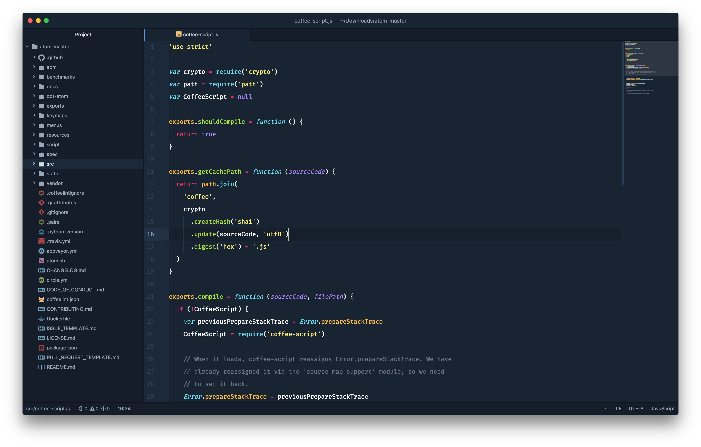

# Monokai | One Dark | Anti-Blue | Syntax Theme

A personalized Atom syntax for the One Dark theme, using a [Monokai Vivid syntax](https://github.com/AshPowell/monokai-one-dark-vivid-syntax) as the baseline.

🏰 Teal gang 💪💪 Blue gang 🙅‍♀️🚮

---

#### Before

#### After

---

